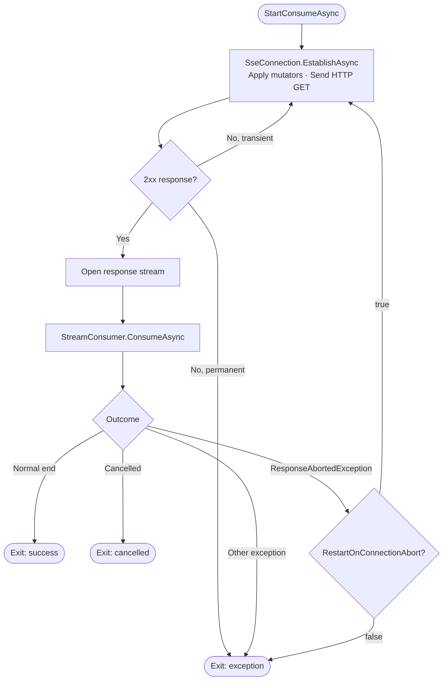
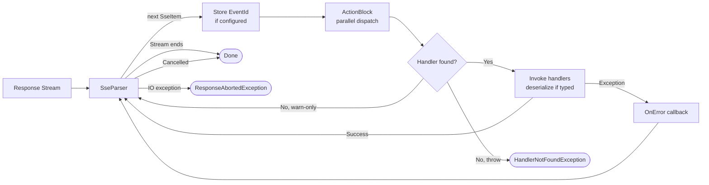

# SseSource Implementation & Architecture

This document describes the internal architecture of `SseSource`, focusing on the connection establishment and event
consumption pipeline at a macro level.

## Overview

`SseSource` is a facade that orchestrates three primary responsibilities:

1. **Connection Management** — Establishing and maintaining the HTTP connection to the SSE endpoint
2. **Request Preparation** — Applying request mutators (authentication, last-event-ID headers, etc.)
3. **Event Processing** — Parsing the SSE stream, dispatching events to handlers, and managing the flow

---

## Consumption Loop & Core Components

### Flow Diagrams

#### Diagram 1 — Connection & Reconnection Loop

The outer loop managed by `SseSource.StartConsumeAsync`. Establishes the HTTP connection, delegates stream consumption
to `StreamConsumer`, and decides whether to reconnect or exit based on the outcome when an error occurs during one of
the two main phases.



#### Diagram 2 — Event Dispatch Pipeline

What happens inside `StreamConsumer` for every received event. The parser feeds events into a parallel `ActionBlock`;
each event is routed to its registered handlers.



### Component Responsibilities

#### 1. **SseSource** (Main Facade)

**File**: `Core/SseSource.cs` + `Core/SseSource.Handlers.cs`

- **State Management**
    - `IsConnected`: Boolean indicating active connection
    - `Completion`: Task that completes when the consumption loop exits
    - `_started`, `_disposed`: Volatile flags preventing reentry and use-after-disposal

- **Handler Registry**
    - Stores event handlers by event name (internal `SseHandlersDictionary`)
    - Supports three registration patterns:
        - Raw strings: `.On("eventName", (string data) => ...)`
        - Strongly-typed: `.On<T>((T data) => ...)` with optional custom event name
        - Full metadata: `.OnItem<T>((SseItem<T> item) => ...)`
        - Reflection-based: `.Bind<TManager>()` (scans public `On*` methods)

- **Lifecycle Callbacks**
  All four are settable properties (not fluent methods):
    - `OnConnectionEstablished` — Invoked after the HTTP response is received and the connection is active
    - `OnConnectionClosed` — Invoked when the server ends the stream cleanly (no error)
    - `OnConnectionLost` — Invoked when the connection drops unexpectedly due to an error
    - `OnError` — Invoked when an exception is thrown inside an event handler
      Exceptions thrown by any of these callbacks are swallowed to protect the consumption loop.

- **Consumption Loop** (`StartConsumeAsync`)
    - Coordinates a retry loop that establishes connections and consumes streams
    - Handles `ResponseAbortedException` based on `RestartOnConnectionAbort` option
    - Propagates other exceptions and cancellations to the `Completion` task

#### 2. **SseConnection** (Connection Management)

**File**: `Core/Internal/SseConnection.cs`

- **Request Preparation** (`EstablishAsync`)
    - Creates an HTTP GET request to the configured endpoint
    - Applies all registered request mutators in order (see [Request Mutators](request-mutators.md))
    - Sets standard SSE headers (`Accept: text/event-stream`)
    - Executes with automatic retry logic for transient failures

- **Retry Strategy**
    - Uses configured `ConnectionRetryOptions` (backoff, max attempts)
    - Delegates transient-failure detection to:
        - Custom predicate: `IsTransientConnectionFailure` option
        - Default logic: socket timeouts/resets, and HTTP error responses whose status code is **not** in
          `NonTransientStatusCodes` (defaults: 404, 401, 403, 500, 502 are never retried)

- **Connection State**
    - `IsConnected` flag (set by `SetConnected()` after successful response)
    - Cleared by `SetDisconnected()` on normal close or error

#### 3. **StreamConsumer** (Event Processing)

**File**: `Core/Internal/StreamConsumer.cs`

- **Stream Parsing** (`ConsumeAsync`)
    - Creates an `SseParser<string>` from the response stream
    - Iterates asynchronously over each incoming `SseItem`
    - Automatically stores the `EventId` in the optional `ILastEventIdStore` for resumption

- **Event Dispatcher**
    - Uses TPL Dataflow `ActionBlock` with configurable `MaxDegreeOfParallelism` (default: `1`, sequential)
    - Ensures ordered intake but allows parallel handler invocation
    - Respects the `CancellationToken` passed from `StartConsumeAsync`

- **Handler Dispatch** (`Dispatch`)
    - Looks up handlers by event type (`EventType` property of `SseItem`)
    - Invokes all registered handlers for that event type
    - Missing handler behavior:
        - Throw `HandlerNotFoundException` if `ThrowWhenNoEventHandlerFound` is `true`
        - Log a warning and skip otherwise
    - Handler exceptions are caught, logged, and passed to the `OnError` callback

- **Error Handling**
    - Detects stream aborts (HTTP IO errors, socket disconnections)
    - Re-throws as `ResponseAbortedException` for the retry loop to handle
    - Validates dispatcher block health before sending events

---

## Request Mutators Pipeline

Request mutators are applied in order before each HTTP request. This allows:

- **Authentication** — `AuthenticationRequestMutator` adds auth headers
- **Last-Event-ID Resumption** — `LastEventIdRequestMutator` adds the `Last-Event-ID` header
- **Custom Mutators** — Any user-supplied `IRequestMutator` implementations

See [Request Mutators](request-mutators.md) for implementation details.

---

## Concurrency Model

### Thread Safety

- **Handler Registry**: The registry is not thread-safe, but handlers should be registered before starting consumption.
  Concurrent registration is not supported.
- **State Flags**: Volatile booleans and `Interlocked` operations prevent race conditions and use-after-dispose.
- **Cancellation**: Linked `CancellationTokenSource` propagates cancellation throughout the pipeline

### Parallelism

- **Handler Invocation**: Parallel via TPL Dataflow `ActionBlock` with configurable degree
- **Deserialization**: Happens inline during handler dispatch
- **I/O Operations**: All async/await, no blocking calls

### No Back-Pressure

The `ActionBlock` is created with no `BoundedCapacity`, so its input buffer is unbounded. The parser feeds events into
it as fast as the SSE stream produces them, regardless of how quickly handlers consume them. If handlers are slow,
the buffer grows without limit. This design prioritizes simplicity and throughput but may lead to increased memory usage
under high load or slow handlers. Users should monitor and configure `MaxDegreeOfParallelism` appropriately.

---

## Configuration & Options

The behavior of `SseSource` is controlled via `SseSourceOptions`:

| Property                       | Default                                                                      | Description                                                                                                                                                                                                                        |
|--------------------------------|------------------------------------------------------------------------------|------------------------------------------------------------------------------------------------------------------------------------------------------------------------------------------------------------------------------------|
| `Path`                         | `/sse`                                                                       | Relative or absolute URL of the SSE endpoint.                                                                                                                                                                                      |
| `MaxDegreeOfParallelism`       | `1`                                                                          | Maximum number of event handlers that run concurrently.                                                                                                                                                                            |
| `DefaultEventNameCasePolicy`   | `PascalCase`                                                                 | Naming policy used when deriving event names from C# type names or `On*` method names.                                                                                                                                             |
| `ConnectionRetryOptions`       | `RetryOptions.None`                                                          | Retry policy for connection failures. Set to `null` or `RetryOptions.None` to disable.                                                                                                                                             |
| `ThrowWhenNoEventHandlerFound` | `false`                                                                      | When `true`, throws `HandlerNotFoundException` for events with no registered handler; otherwise logs a warning and skips.                                                                                                          |
| `RestartOnConnectionAbort`     | `true`                                                                       | Automatically restarts the connection loop after a `ResponseAbortedException`.                                                                                                                                                     |
| `NonTransientStatusCodes`      | `NotFound`, `InternalServerError`, `BadGateway`, `Unauthorized`, `Forbidden` | HTTP status codes treated as permanent failures. When the server responds with one of these codes, no retry is attempted regardless of `ConnectionRetryOptions`.                                                                   |
| `IsTransientConnectionFailure` | `null`                                                                       | Custom predicate that decides whether a connection-phase exception is transient and should trigger a retry. Overrides the built-in transient detection logic when set.                                                             |
| `IsResponseAborted`            | `null`                                                                       | Custom predicate that decides whether a stream-phase exception represents a connection abort. When set and returns `true`, the source treats the exception as a `ResponseAbortedException` and honours `RestartOnConnectionAbort`. |
| `JsonSerializerOptions`        | A default `JsonSerializerOptions` instance that ignores properties name case | Allow to set the options used by the JSON serializer when deserializaing event data.                                                                                                                                               |

See [Configuration](configuration.md) for details.

---

## Lifecycle & Cleanup

### Initialization

```csharp
var source = new SseSource(httpClient, options, requestMutators, lastEventIdStore, logger);
```

### Usage

```csharp
source.On<MyEvent>(e => Console.WriteLine(e));
source.OnError = ex => Console.Error.WriteLine(ex);
source.OnConnectionEstablished = () => Console.WriteLine("Connected");

await source.StartConsumeAsync(cancellationToken);
```

### Disposal

`SseSource` implements both `IDisposable` and `IAsyncDisposable`:

```csharp
await source.DisposeAsync();  // Preferred: cancels the loop and waits for graceful shutdown
```

or

```csharp
source.Dispose();  // Synchronous: cancels the loop but does not wait
```

**Note**: Calling `Dispose` or `DisposeAsync` while `StartConsumeAsync` is running cancels the internal
`CancellationTokenSource`, which causes the consumption loop to detect cancellation and complete `Completion` as *
*success** (not as cancelled).

---

## Last-Event-ID & Resumption

If an `ILastEventIdStore` is provided:

1. The `StreamConsumer` stores each incoming event's `EventId` (if present)
2. On reconnection, the `LastEventIdRequestMutator` reads the stored ID
3. The `Last-Event-ID` header is added to the reconnection request
4. The server can use this to resume from the last event

This enables resilient consumption where reconnections do not lose events.

See [Last-Event-ID Resumption](last-event-id.md) for details.

---

## Error Scenarios & Recovery

| Scenario                                    | Behavior                                                                                                |
|---------------------------------------------|---------------------------------------------------------------------------------------------------------|
| **Connection fails (transient)**            | Auto-retry per `ConnectionRetryOptions`                                                                 |
| **Connection fails (permanent, e.g., 404)** | Exception thrown, consumption loop exits                                                                |
| **Stream aborts unexpectedly**              | Re-raise as `ResponseAbortedException`; if `RestartOnConnectionAbort` is true, retry the loop           |
| **Handler throws exception**                | Log error; invoke `OnError` callback; continue processing other events                                  |
| **Unknown event type**                      | Log warning and skip; throw `HandlerNotFoundException` only if `ThrowWhenNoEventHandlerFound` is `true` |
| **Cancellation requested**                  | Gracefully shut down, propagate to `Completion` task                                                    |

---

## Dependency Injection Integration

When using `SsePulse.Client.DependencyInjection`:

1. `AddSseSource()` registers a builder that configures options, HTTP client, handlers, and mutators
2. Request mutators and handlers are composed at construction time
3. The factory creates `SseSource` instances with all configurations pre-applied
4. Named sources are supported via `ISseSourceFactory`

See [Dependency Injection](dependency-injection.md) for details.

---

## Summary

The `SseSource` architecture is built around a simple, layered model:

- **SseSource** (facade) — Coordinates the lifecycle and state
- **SseConnection** (connection layer) — Establishes HTTP connections with retry
- **StreamConsumer** (parsing layer) — Parses events and dispatches to handlers in parallel
- **Handler Registry** (dispatch layer) — Routes events to registered handlers with optional deserialization

This design allows for:

- ✅ Clean separation of concerns
- ✅ Testability via mocks and in-memory streams
- ✅ Extensibility via request mutators and custom handlers
- ✅ Robust error handling and recovery
- ✅ Efficient parallel event processing
- ✅ Optional persistence of event IDs for resumption

